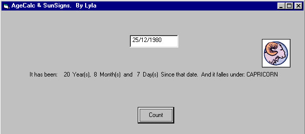



## AgeCalc and SunSigns

### Description

Hi. This is another version of the code i posted last year at:

http://www.planet-source-code.com/vb/scripts/ShowCode.asp?lngWId=1&txtCodeId=5439

This time it Calculates Age/periods and shows SunSign it falles under " With pictures!"

fully commented. Hope you like it, constructive Comments and/or votes are appreciated.
 
### More Info
 
Date

Check the code. It's simple.

Number of Years, Months and days.

SunSigns with pictures!

             |
---                |---
**Submitted On**   |2001-09-02 14:50:28
**By**             |[Lyla](https://github.com/Planet-Source-Code/PSCIndex/blob/master/ByAuthor/lyla.md)
**Level**          |Intermediate
**User Rating**    |4.0 (8 globes from 2 users)
**Compatibility**  |VB 5\.0, VB 6\.0
**Category**       |[Math/ Dates](https://github.com/Planet-Source-Code/PSCIndex/blob/master/ByCategory/math-dates__1-37.md)
**World**          |[Visual Basic](https://github.com/Planet-Source-Code/PSCIndex/blob/master/ByWorld/visual-basic.md)
**Archive File**   |[AgeCalc an25761922001\.zip](https://github.com/Planet-Source-Code/lyla-agecalc-and-sunsigns__1-26892/archive/master.zip)

